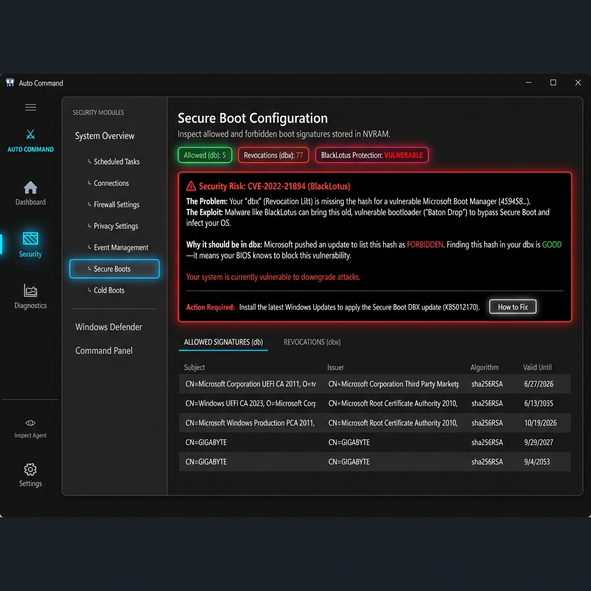

# 🛡️ Auto Command

**Auto Command** is a next-generation system security monitor for Windows, designed to bring enterprise-grade forensics to a premium, consumer-friendly interface. It goes beyond simple monitoring to provide active protection, firmware-level inspection, and automated vulnerability mitigation.

[](https://github.com/dparksports/SystemMonitor/releases/tag/v3.13.0)



## 🚀 Key Capabilities

### 🔒 **Advanced Firmware Protection (New in v3.13)**
Directly interface with your motherboard's NVRAM to detect and mitigate stealthy bootkits.
*   **BlackLotus Detection**: Built-in scanner specifically targets CVE-2022-21894 ("Baton Drop"), checking your `dbx` revocation list for the required hashes.
*   **Auto-Fix Remediation**: Automatically downloads and applies the official Microsoft DBX update (KB5012170) to patch vulnerable systems, complete with SHA256 checksum verification for safety.
*   **Real-time Monitoring**: Watch for unauthorized changes to your Secure Boot policy (`db` allowed signatures and `dbx` revocations).

### ⚡ **Interactive Security Dashboard**
*   **Live Threat Status**: The main dashboard gives you an instant, color-coded health status (e.g., "Firmware Risk").
*   **Deep Drill-Down**: Click on any status card or shield to instantly navigate to the relevant deep-dive inspection tool.
*   **System Activity Feed**: A unified timeline of all security events, firewall changes, and device connections.

### 🛡️ **Network & Firewall Dominance**
*   **Clarified Rules**: Auto Command groups and organizes your firewall rules, making it easy to spot anomalies.
*   **Drift Defense**: Get alerted immediately if a program or Windows Update silently modifies your firewall configuration.
*   **Traffic Analysis**: Monitor active connections in real-time to identify suspicious "phone home" activity.

### 🧠 **Intelligent Automation**
*   **Process Assassin**: Identify and terminate hidden background processes that standard Task Manager misses.
*   **Smart Debloat**: Toggle telemetry and bloatware services without needing deep technical knowledge.
*   **Zero-Lag UI**: Built on a modern, multi-threaded architecture that ensures the interface remains fluid even during intensive scans.

---

## 📥 Getting Started

1.  **Download**: Get the latest `AutoCommand.zip` from the [Releases Page](https://github.com/dparksports/SystemMonitor/releases).
2.  **Extract**: Unzip to a permanent location (e.g., `C:\Program Files\AutoCommand`).
3.  **Run**: Launch `AutoCommand.exe` as Administrator (required for low-level hardware access).

---

## 🛠️ Build it Yourself

**Requirements**: Windows 10/11, .NET 8.0 SDK

```powershell
# Clone the repository
git clone https://github.com/dparksports/SystemMonitor.git

# Navigate to the project
cd SystemMonitor/DeviceMonitorCS

# Build Release
dotnet build -c Release
```

---

<p align="center">Made with ❤️ for the Windows enthusiast community.</p>
