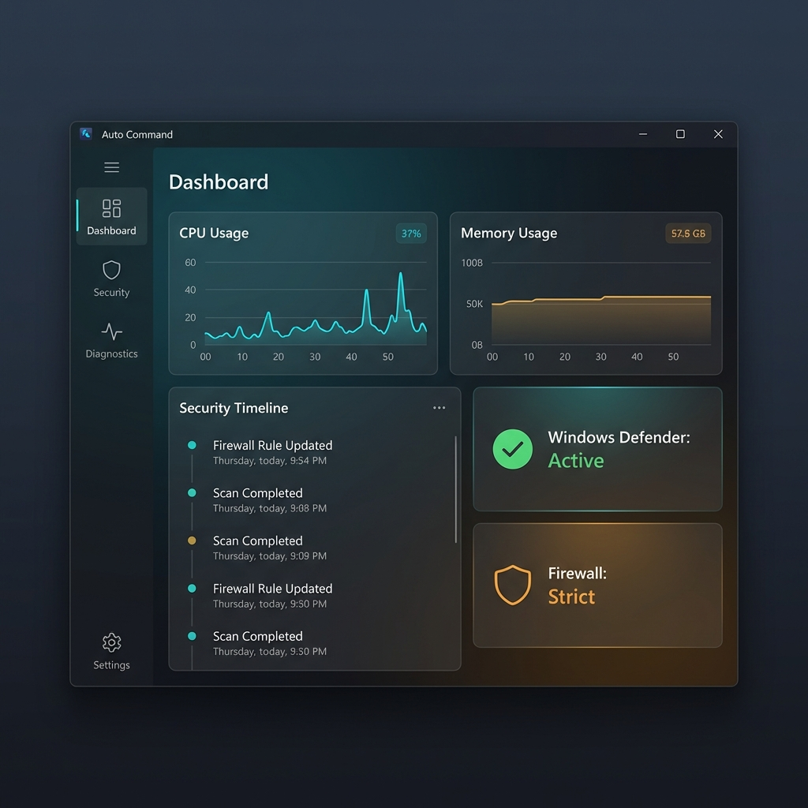

# ⚔ Auto Command

**Auto Command** is a high-fidelity Windows system monitoring and security command center. It combines real-time data accuracy with a premium "Aurora" glassmorphism interface, providing a professional workspace for power users to track system health and security telemetry.

## 🚀 Key Features

### 🛡️ Unified Command Panel
The heart of Auto Command, providing one-click management for critical system interfaces often exploited as "Security Holes."
- **Network Hole Management**: Instantly toggle and natively uninstall WAN Miniports, WiFi Direct Virtual Adapters, and Kernel Debug Network Adapters (KDNET).
- **Privacy Toggles**: Global control over background VPN services, wireless entry points, and Windows flighting/telemetry tasks.
- **Real-time Monitoring**: Integrated status checks for Windows Defender Tamper Protection and boot configuration flags.

### 🔍 Advanced Diagnostics
- **Firmware Explorer**: Deep dive into ACPI tables and UEFI variables with detailed byte-level views.
- **Security Timeline**: Track historical system events to identify suspicious patterns or configuration changes.
- **Device Management**: A high-performance replacement for Device Manager with advanced property enumeration and native uninstallation capabilities.

### ⚙️ System Tools
- **Scheduled Tasks**: Browse and audit Windows tasks with an intuitive interface.
- **Network Connections**: High-visibility monitoring of active network sockets and traffic.
- **True Shutdown**: Bypass Windows "Fast Startup" to perform a complete hardware power-off, ensuring a fresh state on the next boot.
- **Firewall Controls**: Streamlined management of profiles and rule sets.

## 💎 Premium Design
Current Stable Release: **v3.9.2** (Clean Code Edition)
- **Glassmorphism UI**: Developed with modern WPF styling for a translucent material look.
- **Integrated Window Chrome**: Precise control over title bar elements for a native "App" feel.
- **Material Aura Lighting**: Sophisticated lighting effects that feel like light passing through glass.

## 🛠 Technical Overview
- **Core Engine**: .NET 8.0 (C# 12)
- **Data Access**: WMI, Windows Event Log API, and Native Win32 interop.
- **Analytics**: Firebase Analytics integration for high-fidelity usage metrics.
- **Licensing**: Apache License, Version 2.0.

## 📦 Getting Started
1.  **Download**: Get the [latest v3.9.2 portable archive (Clean Code Edition)](https://github.com/dparksports/SystemMonitor/releases/download/v3.9.2/AutoCommand_v3.9.2.zip).
2.  **Unzip**: Extract the **entire folder** to a location of your choice.
3.  **Elevation**: Run `AutoCommand.exe` as **Administrator**.

---
Made with ❤️ in California.
