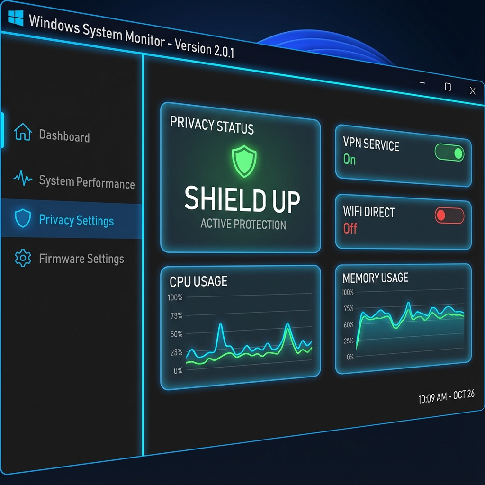

# Windows System Monitor (Active Defense Hub)



## 🛡️ The Concept
**Windows System Monitor** is not just another passive logger. It is an **Active Defense Hub** designed for power users and security administrators who need real-time visibility and **instant automated response** capabilities.

While traditional windows tools (Event Viewer, Device Manager) are fragmented and reactive, this application unifies system telemetry into a single **Dark Neon Dashboard** and actively neutralizes threats the moment they appear.

## ✨ Key Features (v2.1.0)

### 1. 🧠 Automated Security Enforcement
The application runs a background `SecurityEnforcer` loop (configurable interval) that doesn't just watch—it acts.
*   **Anti-Tunneling**: Instantly detects unauthorized "WAN Miniport (SSTP)" adapters.
    *   **Action**: Stops Service ➔ Disables Service ➔ Disables Adapter ➔ **Uninstalls Device**.
    *   **Alert**: Dashboard turns **RED** and triggers an AI forensic explanation.
*   **Hosted Network Killer**: Automatically blocks the creation of SoftAP hotspots ("Microsoft Hosted Network Virtual Adapter") to prevent unauthorized bridging.

### 2. 📊 Modern Glass-Morphism Dashboard
All critical system data is aggregated into one view:
*   **Live Status Cards**: Real-time gauges for System Security, Network Shield, and Automated Tasks.
*   **Unified Event Stream**: See Hardware plug-and-play events side-by-side with Windows Security Audit logs.
*   **Glass UI**: A beautiful, deep dark theme (`#1E1E1E`) with neon accents (Cyan/Green/Amber) that looks at home on modern Windows 11 setups.

### 3. 🤖 Integrated Gemini AI Forensics
Don't just see "Event ID 4624" — understand it.
*   **Context Aware**: Right-click ANY log entry (Process, Connection, Security Event) -> "Ask AI about this".
*   **Incident Analysis**: The AI analyzes the specific metadata and explains *why* a process triggered a network connection or why a security event matters.

### 4. 🛠️ Power Tools
*   **VPN Kill Switch**: One-click toggle to Stop and Disable all VPN-related services (`RasMan`, `IKEEXT`, etc.).
*   **Connection Monitor**: view active TCP/UDP connections with "WhoIs" geo-location (Country/ISP).
*   **Scheduled Task Manager**: Find and disable high-privilege scheduled tasks that often hide malware persistence.

## 🚀 Installation

1.  **Download** the latest release:
    *   [**DeviceMonitorCS.zip (v2.1.0)**](https://github.com/dparksports/DeviceMonitor/releases/download/v2.1.0/DeviceMonitorCS.zip)
2.  **Extract** the zip file.
3.  **Run as Administrator**: Right-click `DeviceMonitorCS.exe` -> "Run as Administrator".
    *   *Admin rights are required to interact with Windows Services and Security Logs.*

## ⚙️ Configuration
*   **Scan Interval**: Go to the **Settings** tab to adjust how aggressively the Security Enforcer scans (Default: 2000ms).
*   **AI API**: Place your Gemini API key in `apikey.txt` to enable AI features.

### 🛡️ Auto-Start at Logon
Since this tool requires Administrator privileges, the best way to start it automatically is via **Task Scheduler** (bypasses UAC prompts).

**Run this command (Requires Admin PowerShell):**
*(Note: If you get "Access is denied", right-click PowerShell and select "Run as Administrator")*
```powershell
schtasks /create /tn "StartSystemMonitor" /tr "'C:\Path\To\DeviceMonitorCS.exe'" /sc onlogon /rl highest /f
```
*(Replace `C:\Path\To\...` with the actual path to your extracted executable)*

---
*Built with .NET 6 WPF & Modern C#*
