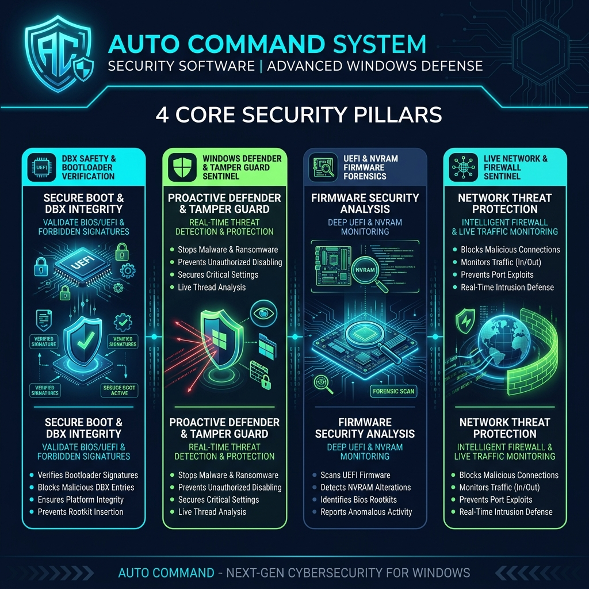

# 🛡️ Auto Command

<p align="center">
  <strong>Next-Generation System Security & Firmware Forensics Monitor for Windows</strong>
</p>

<p align="center">
  <a href="https://github.com/dparksports/SystemMonitor/releases/tag/v3.15.2"></a>
  <a href="https://dotnet.microsoft.com/"></a>
  <a href="LICENSE"></a>
  <a href="https://github.com/dparksports/SystemMonitor/stargazers"></a>
</p>

---



## 📌 Overview

**Auto Command** is a high-performance system security dashboard and forensic monitoring application designed for Windows 10 and Windows 11. It bridges the gap between low-level kernel/firmware diagnostics and modern, human-centric visual interfaces. 

Whether you are auditing system boot integrity, monitoring Windows Defender event streams, inspecting active socket connections, or verifying UEFI DBX revocation lists, **Auto Command** delivers enterprise-grade security oversight in a sleek, real-time interface.

---

## 🔥 Key Features & Capabilities

### 🔑 **1. DBX Safety & Bootloader Verification**
Pre-flight bootloader integrity analysis and automated vulnerability remediation.
* **Bootloader Hash Verification**: Compares the active running bootloader signature against the UEFI Forbidden Signature Database (`dbx`).
* **Bootkit Defense**: Detects vulnerability to stealthy UEFI bootkits such as **BlackLotus** (CVE-2022-21894).
* **Automated Repair Handoff**: Reinstall clean Microsoft Bootloader binaries (`bcdboot`) or launch Windows Recovery (`ms-settings:recovery`) with a single click.

### 🛡️ **2. Windows Defender & Tamper Protection Sentinel**
Real-time monitoring and event log extraction for Microsoft Defender.
* **Tamper Protection Guard**: Monitors local vs. cloud-managed Tamper Protection states (`TamperProtectionSource`), detecting local user configurations (bitmask values `1` / `5`).
* **Operational Event Log Parser**: Direct streaming of critical Defender Event IDs (`1000-1006`, `1116`, `1117`, `2000`, `2002`, `3002`, `5001`, `5007`, `5013-5015`).
* **Real-Time Protection Health**: Monitors Real-Time Scan engine health, signature update timestamps, and active threat detections.

### 🔒 **3. UEFI & NVRAM Firmware Forensics**
Direct low-level hardware inspection of motherboard firmware settings.
* **Signature Database Visualizer**: Inspect raw NVRAM variables including `db` (Allowed Signatures) and `dbx` (Revoked Signatures).
* **Secure Boot Auditor**: Validates Platform Key (PK), Key Exchange Key (KEK), and Secure Boot enforcement state.

### 🌐 **4. Live Network & Firewall Dominance**
* **Active Connection Tracker**: Real-time auditing of established TCP/UDP network connections, remote IP addresses, and process bindings.
* **Firewall Profile Sentinel**: Audits Public, Private, and Domain firewall profiles to instantly spot exposed critical ports (e.g., RDP Port 3389, SMB Port 445).
* **Drift Alert Engine**: Detects unauthorized firewall rule changes or background profile alterations.

---

## ⚡ What's New in Version 3.15.2

- 🛡️ **Improved Tamper Protection Detection**: Accurately recognizes local user-managed Tamper Protection states (bitmask value `5`) alongside enterprise policy flags.
- 🔇 **Silent PowerShell Invocation**: Added `-NoProfile -NonInteractive -ExecutionPolicy Bypass` flags to eliminate `$PROFILE` warnings from security queries.
- 🛠️ **Robust MSBuild Integration**: Conditionalized external dependencies (`sigcheck64.exe`) for zero-warning compilation on .NET 8.0 and .NET 10 SDKs.

---

## 📥 Installation & Setup

1. **Download**: Grab the latest release package (`AutoCommand.zip`) from the [Releases Page](https://github.com/dparksports/SystemMonitor/releases/tag/v3.15.2).
2. **Extract**: Unpack the ZIP archive to your preferred directory (e.g., `C:\Program Files\AutoCommand`).
3. **Run as Administrator**: Right-click `AutoCommand.exe` and select **Run as Administrator** *(Administrator privileges are required to access UEFI NVRAM variables and Defender operational event logs)*.

---

## 🛠️ Building from Source

### Prerequisites
* **OS**: Windows 10 or Windows 11 (64-bit)
* **SDK**: [.NET 8.0 SDK](https://dotnet.microsoft.com/download/dotnet/8.0) or [.NET 10.0 SDK](https://dotnet.microsoft.com/download/dotnet/10.0)
* **IDE**: Visual Studio 2022 / JetBrains Rider / VS Code

### Build Instructions

```powershell
# 1. Clone the repository
git clone https://github.com/dparksports/SystemMonitor.git

# 2. Navigate to the C# WPF project folder
cd SystemMonitor/DeviceMonitorCS

# 3. Restore dependencies & build Release configuration
dotnet build -c Release
```

The output executable will be generated at `DeviceMonitorCS/bin/Release/net8.0-windows/AutoCommand.exe`.

---

## 🏗️ Architecture & Technology Stack

| Layer | Technology |
| :--- | :--- |
| **User Interface** | WPF (Windows Presentation Foundation), Modern XAML Design System |
| **Framework** | .NET 8.0 / .NET 10.0 C# |
| **System Diagnostics** | WMI (`System.Management`), Native Windows Event Log APIs |
| **Security APIs** | Windows Defender Security Center, `Get-MpComputerStatus`, `Get-NetFirewallProfile` |
| **Firmware Subsystem** | Native UEFI NVRAM Variable Reading (`GetFirmwareEnvironmentVariable`) |

---

## 📄 License & Author

Distributed under the **MIT License**. See [`LICENSE`](LICENSE) for details.

* **Author**: Dan Park ([dpark@magicpoint.ai](mailto:dpark@magicpoint.ai))
* **Repository**: [github.com/dparksports/SystemMonitor](https://github.com/dparksports/SystemMonitor)

---

<p align="center">
  Made with ❤️ in California.
</p>
